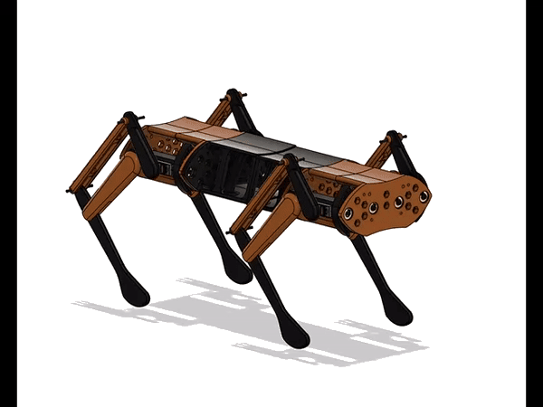

# DHARMA BOT :dog2::robot:

Dharma Bot is a sophisticated quadruped robotic dog featuring 12 degrees of freedom (DOF) for dynamic motion. The system includes a custom-designed remote control and smartwatch, which collectively offer seamless user interaction, control, and monitoring capabilities.

## Authors :writing_hand:

- [@mr-spaw](https://github.com/mr-spaw) :space_invader:
- [@LordCretivo](https://github.com/LordCretivo) :teddy_bear:
- [@DeepseaBandit](https://github.com/DeepseaBandit) :smirk_cat:

## Documentation :notebook_with_decorative_cover:

[Documentation](https://docs.google.com/document/d/14A3U6bSW9qBQt6sxEBGoiQTC8-wSntHT5azrs7TC3jw/edit?usp=sharing)

## System Overview :joystick: 
Dharma Bot is composed of three primary, electronically independent subsystems:
1. **The Bot**: The robotic dog, with core control and motion capabilities.
2. **Smart Remote**: The main control interface for the bot, featuring a Raspberry Pi, touchscreen, and long-range communication.
3. **Smartwatch**: A peripheral control and monitoring device equipped with sensors and ESP-32-based communications.
4. **Turret System**: The turret system is a rotating module mounted on the bot, designed to carry cameras and sensors. It provides 360-degree horizontal rotation and adjustable vertical tilt, enabling the bot to monitor or track targets in multiple directions.
4. **Gripper**:  It also consist of a hand gripper which is a versatile, precision-handling tool with adjustable grip strength and articulated fingers. It enables the dog to pick up, hold, and manipulate objects, performing tasks like delivering items or interacting with its environment.

## Subsystems

### [Smart Watch](Utility_Watch/watch.md) :watch:
The smartwatch incorporates:
- **ESP-32 WROOM microcontroller**:The SoC of the embedded hardware.
- **OLED screen**: Displays real-time status, bot location, connectivity, and enemy detection data.
- **Pulse-meter sensor** and **GPS**: For monitoring the wearer's health and position.
- **Geotagging**: Logs location of deployed tags for tracking.
- **Heartbeat Monitoring**: In "Military Mode," it locks if the wearer’s pulse reads zero for over 30 seconds.
- **FailSafe Mechanism**: Notifies the remote of the current location upon triggering specific emergency conditions.
- **ESP-NOW Communication**: Provides secure data exchange between the smartwatch and the smart remote.

### [Smart Remote](Utility_Remote/remote.md)  :video_game:
Serving as the primary control hub, the smart remote includes:
- **Raspberry Pi and 7-inch HDMI Touchscreen**: For intuitive control of the whole system architecture.
- **LoRa and ESP-NOW Modules**: Enabling long-range communication up to 10 km in LoRA and about five meters of communication with ESP-NOW protocol
- **GeoTag Integration**: Displays tagged locations on a map for rescue and tracking.
- **Video Streaming**: ESP-32 S3 CAM streaming for real-time surveillance.
- **Manual Controls**: Joysticks, potentiometers, and switches for bot locomotion and firing systems.
- **GUI**: The remote’s GUI interface provides a user-friendly experience, offering control over various modes, video feeds, and sensor data

### [PoC Bot](main_BOT/PoC_Bot.md) :dog2:
The main bot integrates:
- **Teensy 4.1 Microcontroller**: Manages core functions, including servo control and scheduling of Tasks
- **ESP 32 S3 Development Board**: Controlling the Peripheral Electronics like GPS, ToF Sensors and Gyroscopic Readngs.
- **MG99R Servo Motors**: 12 servo motors for precise locomotion.
- **ESP-32 S3 Camera System**: A esp camera system for live video feed.
- **LIDAR and GPS Modules**: For navigation and environmental awareness.
- **Communication**:  Local esp aceess network and long-range LoRa for data exchange between subsystems.

### [ProtoType Bot](main_BOT/PoC_Bot.md) :guide_dog:
The main bot integrates the following components:

- **STM32H755ZI-Q**: Manages core functions, handles communication with the SBCs, and controls peripheral electronics and FOC drivers.
- **STM32G431KB**: Oversees data collection and analysis from the three IMUs.
- **STM32F446RE**: Manages the TOF sensor and facilitates communication through LORA and IBUS.
- **STM32G431-ESC1**: FOC driver with magnetic encoder, enabling precise position control of the BLDC motor.
- **CAN Bus**: All microcontrollers communicate via CAN Bus for synchronized control and data exchange.

### [Turret System](Turret_System/turret.md) :gun:
The turrent has:
- **Raspberry Pi**: Runs a local ML image recognition model and manages peripheral hardware.
- **ESP 32**: Controls the Servo motors

### [Hand Gripper](Gripper\Gripper.md) :mechanical_arm:
The gripper system features:

- **NVIDIA Jetson Orin Nano**: This powerful local SBC runs the reinforcement learning (RL) model, enabling real-time object recognition and environmental analysis using LIDAR and 3D cameras for seamless operation.
- **Waveshare Encoder Servo**: The encoder servo ensures precise and accurate movement of the gripper, allowing for fine-tuned control in handling objects.

## Project Context :star: :india:
This project was developed as part of RoboFest, held in 2024, organised by Gujarat Council on Science and Technology(GUJCOST).

The project has participated in the Grand Final of RoboFest Gujarat 4.0, hosted by the Gujarat Government, in Ahmedabad.

## Social Media :star2:
[Website](https://krs.kiit.ac.in)
[Instagram](https://www.instagram.com/kiit_robotics.society?utm_source=ig_web_button_share_sheet&igsh=ZDNlZDc0MzIxNw==)
[Linkedin](https://www.linkedin.com/company/kiit-robotics-society-bbsr/mycompany/)

## Project Link :link:
https://github.com/KIIT-Robotic-Society/Dharma_RoboFest4.0.git
